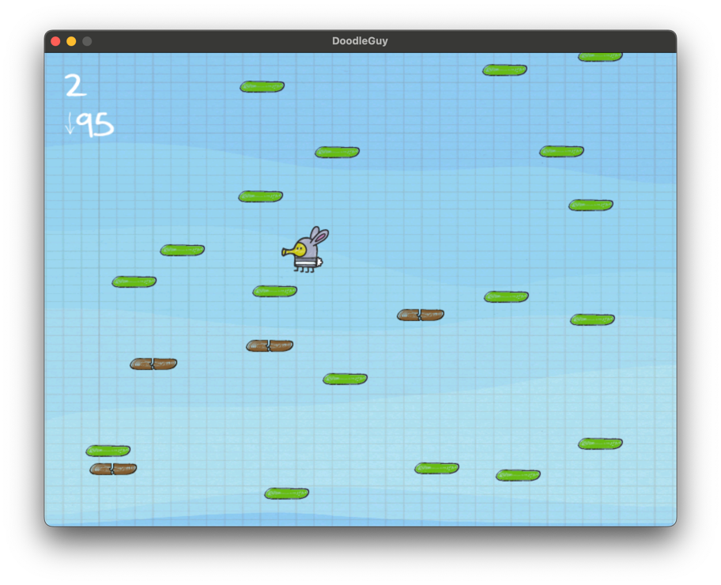

```commandline
 > ./cmake-build-release/doodle_guy -w 600x800
```
Command to run mac-os-version. 

Mac version was built for `arm-x64` processors.



## What was accomplished in this task:
* Player's speed changes based on tiles that he jumps. Jumping on same one
increases speed and switching tiles decreases it.
* There are broken tiles that player can't jump off.
* You can find jetpack that will get you to the stars :O
* Game restarts automatically and shows you your score after death.
* There are enemies that can either be shot or jumped off.
* There is real-time in game ui for speed and score.


## What can be improved:
* Code for spawning different things turned out to be pretty similar.
Perhaps, one could write a generic factory for spawning things in the world.
* Due to the nature of the spawner, the tile score is not totally accurate.
* In many situations, sprites duplicate for different objects. This can be optimized, to access them from 
one entry point.
* Due to time pressure and quick iterations, encapsulation was widely ignored in this architecture. It would be great, 
to take a look at different public variables and put them behind getters and setters.